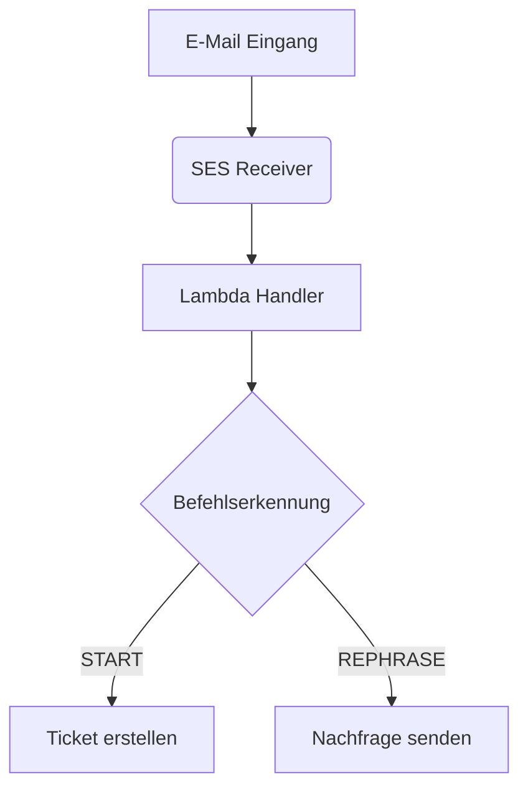

# SupportBot Systemarchitektur

## Übersicht

## Kernkomponenten
1. **E-Mail Eingang**: AWS SES für empfangene E-Mails
2. **Verarbeitung**: AWS Lambda mit Python 3.11
3. **Befehlslogik**: Regex-basierte Erkennung
4. **Antwortgenerierung**: Einfache Textantworten (MVP)

## Entscheidungsbegründungen
- **Warum AWS SES?**: Kostenlos im Free Tier, einfache Integration
- **Warum Lambda?**: Serverless = geringer Wartungsaufwand
- **Warum Regex?**: Einfachheit für MVP, später durch NLP ersetzbar